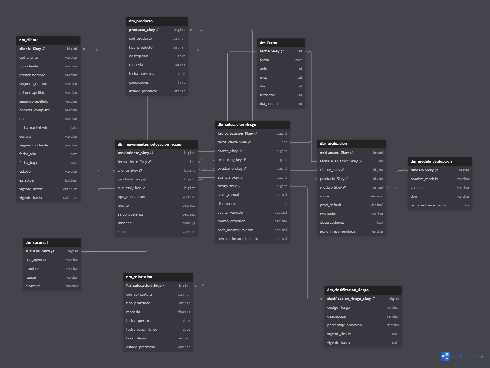
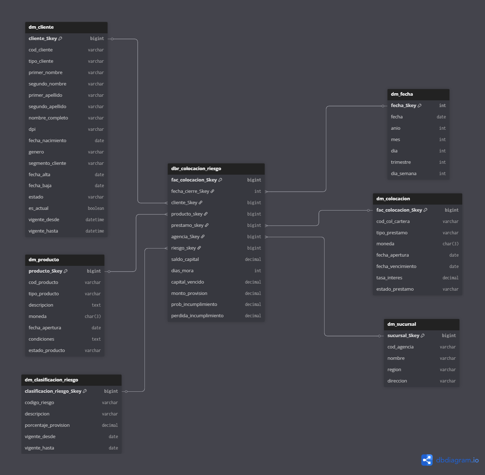
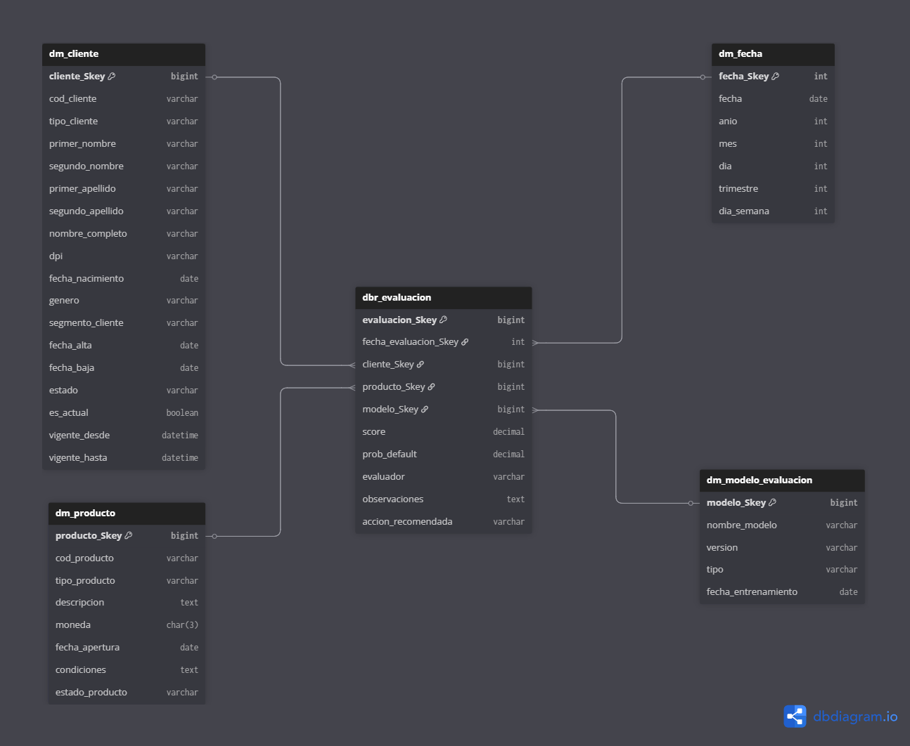
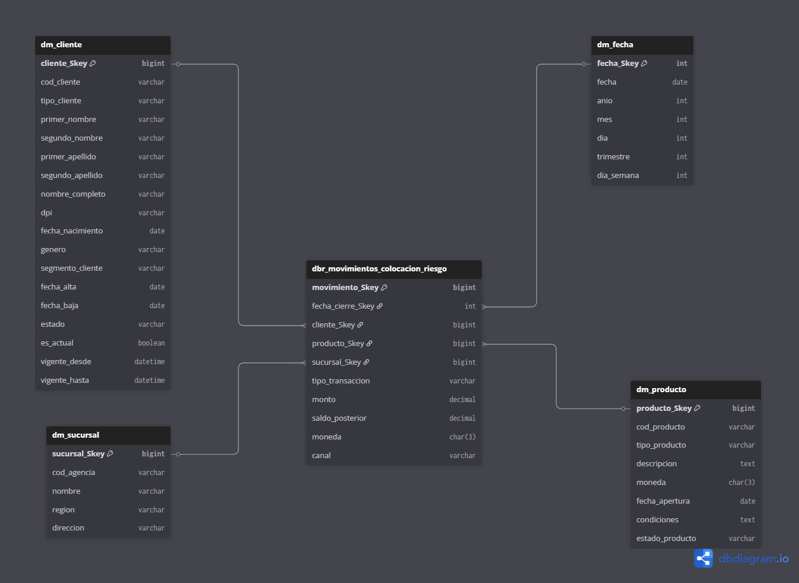

# Documentación del Datamart `chn_dw`


Diagrama ER
## Índice
1. [Tablas Dimensión](#tablas-dimensión)  
    - [dm_cliente](#dm_cliente)  
    - [dm_producto](#dm_producto)  
    - [dm_sucursal](#dm_sucursal)  
    - [dm_fecha](#dm_fecha)  
    - [dm_clasificacion_riesgo](#dm_clasificacion_riesgo)  
    - [dm_modelo_evaluacion](#dm_modelo_evaluacion)  
    - [dm_colocacion](#dm_colocacion)  
2. [Tablas de Hechos](#tablas-de-hechos)  
    - [dbr_colocacion_riesgo](#dbr_colocacion_riesgo)  
    - [dbr_movimientos_colocacion_riesgo](#dbr_movimientos_colocacion_riesgo)  
    - [dbr_evaluacion](#dbr_evaluacion)  

---

## Tablas Dimensión

### `dm_cliente`
Tabla que contiene la información de los clientes del sistema.  

| Campo | Tipo | Descripción |
|-------|------|-------------|
| cliente_Skey | BIGINT IDENTITY | Clave sustituta del cliente (PK) |
| cod_cliente | VARCHAR(50) | Código único del cliente |
| tipo_cliente | VARCHAR(50) | Tipo de cliente: `'PERSONA'` o `'JURIDICO'` |
| primer_nombre | VARCHAR(50) | Primer nombre del cliente (default `'PD'`) |
| segundo_nombre | VARCHAR(50) | Segundo nombre del cliente (default `'PD'`) |
| primer_apellido | VARCHAR(50) | Primer apellido del cliente (default `'PD'`) |
| segundo_apellido | VARCHAR(50) | Segundo apellido del cliente (default `'PD'`) |
| nombre_completo | VARCHAR(200) | Nombre completo del cliente |
| dpi | VARCHAR(50) | Documento de identificación personal (único) |
| fecha_nacimiento | DATE | Fecha de nacimiento |
| genero | VARCHAR(50) | Género: `'M'`, `'F'` o `'OTRO'` |
| segmento_cliente | VARCHAR(50) | Segmento del cliente (default `'PD'`) |
| fecha_alta | DATE | Fecha de alta en el sistema |
| fecha_baja | DATE | Fecha de baja o cierre de cuenta (default `'1999-01-01'`) |
| estado | VARCHAR(50) | Estado activo/inactivo del cliente |
| es_actual | BIT | Indica si el registro está vigente actualmente |
| vigente_desde | DATETIME | Fecha de inicio de vigencia del registro |
| vigente_hasta | DATETIME | Fecha de fin de vigencia del registro |

**Índices:**  
- `IX_dm_cliente_dpi`  
- `IX_dm_cliente_vigencia`  

---

### `dm_producto`
Contiene la información de productos financieros ofrecidos.  

| Campo | Tipo | Descripción |
|-------|------|-------------|
| producto_Skey | BIGINT IDENTITY | Clave sustituta del producto (PK) |
| cod_producto | VARCHAR(50) | Código único del producto |
| tipo_producto | VARCHAR(50) | Tipo de producto |
| descripcion | VARCHAR(500) | Descripción del producto (default `'PD'`) |
| moneda | VARCHAR(50) | Moneda en la que se maneja el producto |
| fecha_apertura | DATE | Fecha de apertura del producto |
| estado_producto | VARCHAR(50) | Estado: `'ACTIVO'` o `'INACTIVO'` |

**Índices:**  
- `IX_dm_producto_codigo`  

---

### `dm_sucursal`
Información de las sucursales o agencias del banco.  

| Campo | Tipo | Descripción |
|-------|------|-------------|
| sucursal_Skey | BIGINT IDENTITY | Clave sustituta de la sucursal (PK) |
| cod_agencia | VARCHAR(50) | Código único de la sucursal |
| nombre | VARCHAR(100) | Nombre de la sucursal |
| region | VARCHAR(100) | Región de ubicación (default `'PD'`) |
| direccion | VARCHAR(200) | Dirección de la sucursal (default `'PD'`) |

---

### `dm_fecha`
Tabla de fechas para análisis temporal.  

| Campo | Tipo | Descripción |
|-------|------|-------------|
| fecha_Skey | INT | Clave sustituta de la fecha (PK) |
| fecha | DATE | Fecha real |
| anio | INT | Año de la fecha |
| mes | INT | Mes (1-12) |
| dia | INT | Día del mes (1-31) |
| trimestre | INT | Trimestre (1-4) |
| dia_semana | INT | Día de la semana (1-7) |

**Índices:**  
- `IX_dm_fecha_anio_mes`  

---

### `dm_clasificacion_riesgo`
Clasificación de riesgo de clientes o préstamos.  

| Campo | Tipo | Descripción |
|-------|------|-------------|
| clasificacion_riesgo_Skey | BIGINT IDENTITY | Clave sustituta (PK) |
| codigo_riesgo | VARCHAR(50) | Código único de riesgo |
| descripcion | VARCHAR(200) | Descripción del nivel de riesgo |
| porcentaje_provision | DECIMAL(5,4) | Porcentaje de provisión asociado (0 a 1) |
| vigente_desde | DATE | Fecha desde la cual aplica la clasificación |
| vigente_hasta | DATE | Fecha hasta la cual aplica la clasificación |

---

### `dm_modelo_evaluacion`
Modelos de evaluación de riesgo de crédito.  

| Campo | Tipo | Descripción |
|-------|------|-------------|
| modelo_Skey | BIGINT IDENTITY | Clave sustituta (PK) |
| nombre_modelo | VARCHAR(100) | Nombre del modelo |
| version | VARCHAR(50) | Versión del modelo |
| tipo | VARCHAR(50) | Tipo de modelo |
| fecha_entrenamiento | DATE | Fecha de entrenamiento del modelo |

---

### `dm_colocacion`
Información de los préstamos o colocaciones de crédito.  

| Campo | Tipo | Descripción |
|-------|------|-------------|
| fac_colocacion_Skey | BIGINT IDENTITY | Clave sustituta del préstamo (PK) |
| cod_col_cartera | VARCHAR(50) | Código único de colocación |
| tipo_prestamo | VARCHAR(50) | Tipo de préstamo |
| moneda | VARCHAR(50) | Moneda del préstamo |
| fecha_apertura | DATE | Fecha de apertura |
| fecha_vencimiento | DATE | Fecha de vencimiento |
| tasa_interes | DECIMAL(6,3) | Tasa de interés |
| estado_prestamo | VARCHAR(50) | Estado del préstamo |

**Índices:**  
- `IX_dm_colocacion_estado`  

---

## Tablas de Hechos

### `dbr_colocacion_riesgo`
Tabla de hechos que almacena información del saldo y riesgo de las colocaciones.  

| Campo | Tipo | Descripción |
|-------|------|-------------|
| fac_colocacion_Skey | BIGINT IDENTITY | Clave primaria del hecho |
| fecha_cierre_Skey | INT | FK a `dm_fecha` |
| cliente_Skey | BIGINT | FK a `dm_cliente` |
| producto_Skey | BIGINT | FK a `dm_producto` |
| prestamo_Skey | BIGINT | FK a `dm_colocacion` |
| agencia_Skey | BIGINT | FK a `dm_sucursal` |
| riesgo_Skey | BIGINT | FK a `dm_clasificacion_riesgo` |
| saldo_capital | DECIMAL(18,2) | Saldo del capital pendiente |
| dias_mora | INT | Días de mora |
| capital_vencido | DECIMAL(18,2) | Capital vencido |
| monto_provision | DECIMAL(18,2) | Provisión calculada |
| prob_incumplimiento | DECIMAL(5,4) | Probabilidad de incumplimiento |
| perdida_incumplimiento | DECIMAL(5,4) | Pérdida esperada por incumplimiento |

**Índices:**  
- `IX_dbr_colocacion_riesgo_fecha`, `IX_dbr_colocacion_riesgo_cliente`, `IX_dbr_colocacion_riesgo_estado_mora`  

---

### `dbr_movimientos_colocacion_riesgo`
Movimientos o transacciones de colocaciones.  

| Campo | Tipo | Descripción |
|-------|------|-------------|
| movimiento_Skey | BIGINT IDENTITY | Clave primaria del movimiento |
| fecha_cierre_Skey | INT | FK a `dm_fecha` |
| cliente_Skey | BIGINT | FK a `dm_cliente` |
| producto_Skey | BIGINT | FK a `dm_producto` |
| sucursal_Skey | BIGINT | FK a `dm_sucursal` |
| tipo_transaccion | VARCHAR(50) | Tipo de transacción |
| monto | DECIMAL(18,2) | Monto de la transacción |
| saldo_posterior | DECIMAL(18,2) | Saldo posterior a la transacción |
| moneda | VARCHAR(50) | Moneda de la transacción |
| canal | VARCHAR(50) | Canal de atención (default `'PD'`) |

**Índices:**  
- `IX_dbr_movimientos_fecha_sucursal`  

---

### `dbr_evaluacion`
Resultados de evaluaciones de riesgo de clientes.  

| Campo | Tipo | Descripción |
|-------|------|-------------|
| evaluacion_Skey | BIGINT IDENTITY | Clave primaria |
| fecha_evaluacion_Skey | INT | FK a `dm_fecha` |
| cliente_Skey | BIGINT | FK a `dm_cliente` |
| producto_Skey | BIGINT | FK a `dm_producto` |
| modelo_Skey | BIGINT | FK a `dm_modelo_evaluacion` |
| score | DECIMAL(8,4) | Score calculado por el modelo |
| prob_default | DECIMAL(5,4) | Probabilidad de default |
| evaluador | VARCHAR(100) | Nombre del evaluador (default `'PD'`) |
| observaciones | TEXT | Observaciones de la evaluación |
| accion_recomendada | VARCHAR(200) | Acción sugerida por el modelo |

**Índices:**  
- `IX_dbr_evaluacion_modelo_fecha` 


# Solucion examen tecnico analista de datos FABIAN ANTONIO HERNANDEZ VENTURA 

### 1. Diseño de Modelo Conceptual y Entidad Relación
Se adjunta imagen de diagrama entidad relacion 


Esquema para dbr_colocacion_riesgo


Esquema para dbr_evaluacion


Esquema para dbr_movimientos_colocacion_riesgo


### 2. Scripts DDL
Observación general

- Se buscó minimizar la presencia de valores nulos: para campos de texto se asignó el valor 'PD' y para fechas se utilizó 1999-01-01, siguiendo el estándar definido por gerencia.
- Todos los índices se crearon en campos de alta consulta para optimizar el rendimiento de búsqueda y filtrado.

Observaciones por tabla

- dm_cliente: Se incorporaron los campos vigente_desde y vigente_hasta para registrar cambios en segmentos u otros atributos. Esto es útil para proyectos como la matriz bancaria que gestiona la gerencia.
- dm_clasificacion_riesgo: El campo porcentaje_provision refleja el requisito de la SIB de mantener una provisión mínima en caso de que no se cubra una deuda.
- dm_modelo_evaluacion: La tabla se diseñó considerando la implementación futura de modelos crediticios u otros análisis avanzados que la gerencia pueda requerir.
- Otras tablas: Para el resto de las tablas, se siguió el estándar de gerencia y se detalla la información de los campos en la documentación previa.

<pre> ```sql -- 
CREATE TABLE dm_cliente (
    cliente_Skey BIGINT IDENTITY(1,1) PRIMARY KEY,
    cod_cliente VARCHAR(50) NOT NULL UNIQUE,
    tipo_cliente VARCHAR(50) NOT NULL CHECK (tipo_cliente IN ('PERSONA','JURIDICO')), -- SE VERIFICAN QUE DATOS CORRESPONDAN A ESTOS VALORES
    primer_nombre VARCHAR(50) NULL DEFAULT 'PD',
    segundo_nombre VARCHAR(50) NULL  DEFAULT 'PD',
    primer_apellido VARCHAR(50) NULL DEFAULT 'PD',
    segundo_apellido VARCHAR(50) NULL  DEFAULT 'PD',
    nombre_completo VARCHAR(200) NOT NULL,
    dpi VARCHAR(50) NOT NULL UNIQUE, 
    fecha_nacimiento DATE  NOT NULL,
    genero VARCHAR(50) CHECK (genero IN ('M','F','OTRO')),
    segmento_cliente VARCHAR(50) NULL  DEFAULT 'PD',
    fecha_alta DATE NOT NULL,
    fecha_baja DATE NULL DEFAULT ('1999-01-01'),
    estado VARCHAR(50) NOT NULL CHECK (estado IN ('ACTIVO','INACTIVO')),
    es_actual BIT NOT NULL DEFAULT 0,
    vigente_desde DATETIME NOT NULL DEFAULT ('1999-01-01'),
    vigente_hasta DATETIME NULL,
);

CREATE INDEX IX_dm_cliente_dpi ON dm_cliente(dpi);
CREATE INDEX IX_dm_cliente_vigencia ON dm_cliente(vigente_desde, vigente_hasta);


CREATE TABLE dm_producto (
    producto_Skey BIGINT IDENTITY(1,1) PRIMARY KEY,
    cod_producto VARCHAR(50) NOT NULL UNIQUE,
    tipo_producto VARCHAR(50) NOT NULL,
    descripcion VARCHAR(500) NULL DEFAULT 'PD',
    moneda VARCHAR(50) NOT NULL,
    fecha_apertura DATE NOT NULL,
    estado_producto VARCHAR(50) NOT NULL CHECK (estado_producto IN ('ACTIVO','INACTIVO'))
);


CREATE INDEX IX_dm_producto_codigo ON dm_producto(cod_producto);


CREATE TABLE dm_sucursal (
    sucursal_Skey BIGINT IDENTITY(1,1) PRIMARY KEY,
    cod_agencia VARCHAR(50) NOT NULL UNIQUE,
    nombre VARCHAR(100) NOT NULL,
    region VARCHAR(100) NULL DEFAULT 'PD',
    direccion VARCHAR(200) NULL DEFAULT 'PD'
);


CREATE TABLE dm_fecha (
    fecha_Skey INT PRIMARY KEY,
    fecha DATE NOT NULL UNIQUE,
    anio INT NOT NULL,
    mes INT NOT NULL CHECK (mes BETWEEN 1 AND 12),
    dia INT NOT NULL CHECK (dia BETWEEN 1 AND 31),
    trimestre INT NOT NULL CHECK (trimestre BETWEEN 1 AND 4),
    dia_semana INT NOT NULL CHECK (dia_semana BETWEEN 1 AND 7)
);

CREATE INDEX IX_dm_fecha_anio_mes ON dm_fecha(anio, mes);


CREATE TABLE dm_clasificacion_riesgo (
    clasificacion_riesgo_Skey BIGINT IDENTITY(1,1) PRIMARY KEY,
    codigo_riesgo VARCHAR(50) NOT NULL UNIQUE,
    descripcion VARCHAR(200) NOT NULL,
    porcentaje_provision DECIMAL(5,4) NOT NULL CHECK (porcentaje_provision BETWEEN 0 AND 1),
    vigente_desde DATE NOT NULL,
    vigente_hasta DATE NULL,
);


CREATE TABLE dm_modelo_evaluacion (
    modelo_Skey BIGINT IDENTITY(1,1) PRIMARY KEY,
    nombre_modelo VARCHAR(100) NOT NULL,
    version VARCHAR(50) NOT NULL,
    tipo VARCHAR(50) NOT NULL,
    fecha_entrenamiento DATE NOT NULL
);


CREATE TABLE dm_colocacion (
    fac_colocacion_Skey BIGINT IDENTITY(1,1) PRIMARY KEY,
    cod_col_cartera VARCHAR(50) NOT NULL UNIQUE,
    tipo_prestamo VARCHAR(50) NOT NULL,
    moneda VARCHAR(50) NOT NULL,
    fecha_apertura DATE NOT NULL,
    fecha_vencimiento DATE NULL,
    tasa_interes DECIMAL(6,3) NOT NULL CHECK (tasa_interes >= 0),
    estado_prestamo VARCHAR(50) NOT NULL CHECK (estado_prestamo IN ('VIGENTE','COBRO ADMINISTRATIVO','EN PRORROGA','COBRO JUDICIAL','CANCELADO','ANULADO'))
);


CREATE INDEX IX_dm_colocacion_estado ON dm_colocacion(estado_prestamo);


--   TABLAS DE HECHOS


CREATE TABLE dbr_colocacion_riesgo (
    fac_colocacion_Skey BIGINT IDENTITY(1,1) PRIMARY KEY,
    fecha_cierre_Skey INT NOT NULL,
    cliente_Skey BIGINT NOT NULL,
    producto_Skey BIGINT NOT NULL,
    prestamo_Skey BIGINT NOT NULL,
    agencia_Skey BIGINT NOT NULL,
    riesgo_Skey BIGINT NOT NULL,
    saldo_capital DECIMAL(18,2) NOT NULL,
    dias_mora INT NOT NULL CHECK (dias_mora >= 0),
    capital_vencido DECIMAL(18,2) NOT NULL DEFAULT 0,
    monto_provision DECIMAL(18,2) NOT NULL DEFAULT 0,
    prob_incumplimiento DECIMAL(5,4) NULL CHECK (prob_incumplimiento BETWEEN 0 AND 1),
    perdida_incumplimiento DECIMAL(5,4) NULL CHECK (perdida_incumplimiento BETWEEN 0 AND 1),
    CONSTRAINT FK_dbrColRiesgo_fecha FOREIGN KEY (fecha_cierre_Skey) REFERENCES dm_fecha(fecha_Skey),
    CONSTRAINT FK_dbrColRiesgo_cliente FOREIGN KEY (cliente_Skey) REFERENCES dm_cliente(cliente_Skey),
    CONSTRAINT FK_dbrColRiesgo_producto FOREIGN KEY (producto_Skey) REFERENCES dm_producto(producto_Skey),
    CONSTRAINT FK_dbrColRiesgo_prestamo FOREIGN KEY (prestamo_Skey) REFERENCES dm_colocacion(fac_colocacion_Skey),
    CONSTRAINT FK_dbrColRiesgo_agencia FOREIGN KEY (agencia_Skey) REFERENCES dm_sucursal(sucursal_Skey),
    CONSTRAINT FK_dbrColRiesgo_riesgo FOREIGN KEY (riesgo_Skey) REFERENCES dm_clasificacion_riesgo(clasificacion_riesgo_Skey)
);

CREATE INDEX IX_dbr_colocacion_riesgo_fecha ON dbr_colocacion_riesgo(fecha_cierre_Skey);
CREATE INDEX IX_dbr_colocacion_riesgo_cliente ON dbr_colocacion_riesgo(cliente_Skey);
CREATE INDEX IX_dbr_colocacion_riesgo_estado_mora ON dbr_colocacion_riesgo(dias_mora, saldo_capital);


CREATE TABLE dbr_movimientos_colocacion_riesgo (
    movimiento_Skey BIGINT IDENTITY(1,1) PRIMARY KEY,
    fecha_cierre_Skey INT NOT NULL,
    cliente_Skey BIGINT NOT NULL,
    producto_Skey BIGINT NOT NULL,
    sucursal_Skey BIGINT NOT NULL,
    tipo_transaccion VARCHAR(50) NOT NULL,
    monto DECIMAL(18,2) NOT NULL,
    saldo_posterior DECIMAL(18,2) NOT NULL,
    moneda VARCHAR(50) NOT NULL,
    canal VARCHAR(50) NULL DEFAULT 'PD',
    CONSTRAINT FK_dbrMovRiesgo_fecha FOREIGN KEY (fecha_cierre_Skey) REFERENCES dm_fecha(fecha_Skey),
    CONSTRAINT FK_dbrMovRiesgo_cliente FOREIGN KEY (cliente_Skey) REFERENCES dm_cliente(cliente_Skey),
    CONSTRAINT FK_dbrMovRiesgo_producto FOREIGN KEY (producto_Skey) REFERENCES dm_producto(producto_Skey),
    CONSTRAINT FK_dbrMovRiesgo_sucursal FOREIGN KEY (sucursal_Skey) REFERENCES dm_sucursal(sucursal_Skey)
);

CREATE INDEX IX_dbr_movimientos_fecha_sucursal ON dbr_movimientos_colocacion_riesgo(fecha_cierre_Skey, sucursal_Skey);


CREATE TABLE dbr_evaluacion (
    evaluacion_Skey BIGINT IDENTITY(1,1) PRIMARY KEY,
    fecha_evaluacion_Skey INT NOT NULL,
    cliente_Skey BIGINT NOT NULL,
    producto_Skey BIGINT NOT NULL,
    modelo_Skey BIGINT NOT NULL,
    score DECIMAL(8,4) NOT NULL,
    prob_default DECIMAL(5,4) NOT NULL CHECK (prob_default BETWEEN 0 AND 1),
    evaluador VARCHAR(100) NULL DEFAULT 'PD' ,
    observaciones TEXT NULL DEFAULT 'PD',
    accion_recomendada VARCHAR(200) NULL DEFAULT 'PD',
    CONSTRAINT FK_dbrEval_fecha FOREIGN KEY (fecha_evaluacion_Skey) REFERENCES dm_fecha(fecha_Skey),
    CONSTRAINT FK_dbrEval_cliente FOREIGN KEY (cliente_Skey) REFERENCES dm_cliente(cliente_Skey),
    CONSTRAINT FK_dbrEval_producto FOREIGN KEY (producto_Skey) REFERENCES dm_producto(producto_Skey),
    CONSTRAINT FK_dbrEval_modelo FOREIGN KEY (modelo_Skey) REFERENCES dm_modelo_evaluacion(modelo_Skey)
);

CREATE INDEX IX_dbr_evaluacion_modelo_fecha ON dbr_evaluacion(modelo_Skey, fecha_evaluacion_Skey); ``` </pre>

### 3. Creación de ETL en SSIS
- Se creo el siguiente proceso en SSIS, creando el flujo donde primero se llenan las tablas dimensionales y de ultimo las tablas de hechos, esto por las llaves primarias y foraneas
- Para las columnas con fechas se crearon columnas derivadas dado el formato, creando un proceso ETL

- Version Visual Studio y SSIS


### 4. Consultas de Validación
- Observaciones querys se encuentran en la carpeta archivos_respuestas
1. Listar todos los clientes con productos en mora.
<pre> ```sql -- SELECT dc.cod_cliente,
dp.tipo_producto,
dp.descripcion,
dbcr.dias_mora,
dbcr.prestamo_Skey
FROM chn_dw.dbo.dbr_colocacion_riesgo dbcr
LEFT JOIN chn_dw.dbo.dm_cliente dc ON dc.cliente_Skey = dbcr.cliente_Skey
LEFT JOIN chn_dw.dbo.dm_producto dp ON dp.producto_Skey = dbcr.producto_Skey
WHERE dias_mora > 0 
ORDER BY dc.cod_cliente; ``` </pre>

2. Calcular el saldo total por tipo de cliente (individual vs jurídico).

<pre> ```sql -- SELECT
dc.tipo_cliente,
SUM(dbcr.saldo_capital) AS saldo_total
FROM chn_dw.dbo.dbr_colocacion_riesgo dbcr
LEFT JOIN chn_dw.dbo.dm_cliente dc ON dc.cliente_Skey = dbcr.cliente_Skey
GROUP BY dc.tipo_cliente;
 ``` </pre>

3. Mostrar el histórico de clasificaciones de riesgo de un cliente específico.
<pre> ```sql -- SELECT  dc.cod_cliente,
dc.nombre_completo,
df.fecha AS fecha_evaluacion,
dev.score,
dev.prob_default,
dev.evaluador,
dev.observaciones,
dev.accion_recomendada
FROM chn_dw.dbo.dbr_evaluacion dev
LEFT JOIN chn_dw.dbo.dm_fecha df ON df.fecha_Skey = dev.fecha_evaluacion_Skey
LEFT JOIN chn_dw.dbo.dm_cliente dc ON dc.cliente_Skey = dev.cliente_Skey
WHERE dc.cod_cliente = 7449522859 
ORDER BY df.fecha ASC; ``` </pre>


### 5. Consulta Compleja de Análisis
<pre> ```sql -- WITH saldo_mensual AS (
    SELECT 
    cr.cliente_Skey,
    cli.nombre_completo,
    p.descripcion AS producto,
    r.descripcion AS clasificacion_riesgo,
    f.anio,
    f.mes,
    SUM(cr.saldo_capital) AS saldo_mensual
    FROM dbr_colocacion_riesgo cr
    INNER JOIN dm_cliente cli ON cr.cliente_Skey = cli.cliente_Skey
    INNER JOIN dm_producto p ON cr.producto_Skey = p.producto_Skey
    INNER JOIN dm_clasificacion_riesgo r ON cr.riesgo_Skey = r.clasificacion_riesgo_Skey
    INNER JOIN dm_fecha f ON cr.fecha_cierre_Skey = f.fecha_Skey
    GROUP BY cr.cliente_Skey, cli.nombre_completo, p.descripcion, r.descripcion, f.anio, f.mes
),
crecimiento AS (
    SELECT 
        cliente_Skey,
        nombre_completo,
        producto,
        clasificacion_riesgo,
        anio,
        mes,
        saldo_mensual,
        LAG(saldo_mensual) OVER (PARTITION BY cliente_Skey ORDER BY anio, mes) AS saldo_anterior,
        CASE WHEN LAG(saldo_mensual) OVER (PARTITION BY cliente_Skey ORDER BY anio, mes) = 0 
        THEN NULL
         ELSE (saldo_mensual - LAG(saldo_mensual) OVER (PARTITION BY cliente_Skey ORDER BY anio, mes)) * 1.0 / LAG(saldo_mensual) OVER (PARTITION BY cliente_Skey ORDER BY anio, mes) * 100
        END AS crecimiento_pct
    FROM saldo_mensual
),
saldo_total_cliente AS (
    SELECT 
    cliente_Skey,
    nombre_completo,
    producto,
    clasificacion_riesgo,
    SUM(saldo_mensual) AS saldo_total,
    AVG(crecimiento_pct) AS crecimiento_promedio
    FROM crecimiento
    GROUP BY cliente_Skey, nombre_completo, producto, clasificacion_riesgo
)
SELECT TOP 10 *
FROM saldo_total_cliente
ORDER BY saldo_total DESC;; ``` </pre>

### 6. Detección de Anomalías 
<pre> ```sql --WITH movimientos_recientes AS (
    SELECT 
    cliente_Skey,
    SUM(monto) AS total_30dias
    FROM dbr_movimientos_colocacion_riesgo m
    INNER JOIN dm_fecha f ON m.fecha_cierre_Skey = f.fecha_Skey
    WHERE f.fecha >= DATEADD(DAY, -30, GETDATE())  -- últimos 30 días
    GROUP BY cliente_Skey
),
promedio_historico AS (
    SELECT 
    cliente_Skey,
    AVG(monto_mes) AS promedio_historico
    FROM (
        SELECT 
            cliente_Skey,
            f.anio,
            f.mes,
            SUM(monto) AS monto_mes
    FROM dbr_movimientos_colocacion_riesgo m
    INNER JOIN dm_fecha f ON m.fecha_cierre_Skey = f.fecha_Skey
    GROUP BY cliente_Skey, f.anio, f.mes
    ) t
    GROUP BY cliente_Skey
)
SELECT 
r.cliente_Skey,
c.nombre_completo,
r.total_30dias,
h.promedio_historico,
CAST((r.total_30dias*1.0 / h.promedio_historico) * 100 AS DECIMAL(10,2)) AS porcentaje_vs_promedio
FROM movimientos_recientes r
INNER JOIN promedio_historico h ON r.cliente_Skey = h.cliente_Skey
INNER JOIN dm_cliente c ON r.cliente_Skey = c.cliente_Skey
WHERE r.total_30dias > 3 * h.promedio_historico  -- más del 300%
ORDER BY porcentaje_vs_promedio DESC; ``` </pre>

### 7. Optimización de Query
<pre> ```sql -- SELECT c.nombre,
p.tipo_producto,
t.fecha,
t.monto
FROM transacciones t
LEFT JOIN productos p ON p.producto_id = t.producto_id
LEFT JOIN clientes c ON c.cliente_id = p.cliente_id
WHERE t.fecha >= '2024-01-01' 
	AND t.monto > 5000
ORDER BY t.fecha DESC

-- SUGERENCIA INDICE PRODUCTO
CREATE INDEX idx_productos_clienteid ON productos (cliente_id);
CREATE INDEX idx_transacciones_productoid ON transacciones (producto_id); ``` </pre>

### 8. Limpieza de Datos 
- LIMPIEZA DPI 13 digitos en columna derivada 
<pre> ```sql -- (LEN(REPLACE(REPLACE(REPLACE(TRIM(dpi),"-","")," ",""),".","")) == 13 && ISNUMERIC(REPLACE(REPLACE(REPLACE(TRIM(dpi),"-","")," ",""),".",""))) ? REPLACE(REPLACE(REPLACE(TRIM(dpi),"-","")," ",""),".","") : NULL(DT_WSTR,13)
 ``` </pre>

 - LIMPIEZA DPI 13 digitos en columna derivada 
<pre> ```sql -- (LEN(REPLACE(REPLACE(REPLACE(TRIM(dpi),"-","")," ",""),".","")) == 13 && ISNUMERIC(REPLACE(REPLACE(REPLACE(TRIM(dpi),"-","")," ",""),".",""))) ? REPLACE(REPLACE(REPLACE(TRIM(dpi),"-","")," ",""),".","") : NULL(DT_WSTR,13)
 ``` </pre>


 - LIMPIEZA DPI 13 digitos en columna derivada 
<pre> ```sql -- (LEN(REPLACE(REPLACE(REPLACE(TRIM(dpi),"-","")," ",""),".","")) == 13 && ISNUMERIC(REPLACE(REPLACE(REPLACE(TRIM(dpi),"-","")," ",""),".",""))) ? REPLACE(REPLACE(REPLACE(TRIM(dpi),"-","")," ",""),".","") : NULL(DT_WSTR,13)
 ``` </pre>

 - LIMPIEZA DPI 13 digitos en columna derivada 
<pre> ```sql -- (LEN(REPLACE(REPLACE(REPLACE(TRIM(dpi),"-","")," ",""),".","")) == 13 && ISNUMERIC(REPLACE(REPLACE(REPLACE(TRIM(dpi),"-","")," ",""),".",""))) ? REPLACE(REPLACE(REPLACE(TRIM(dpi),"-","")," ",""),".","") : NULL(DT_WSTR,13)
 ``` </pre>

